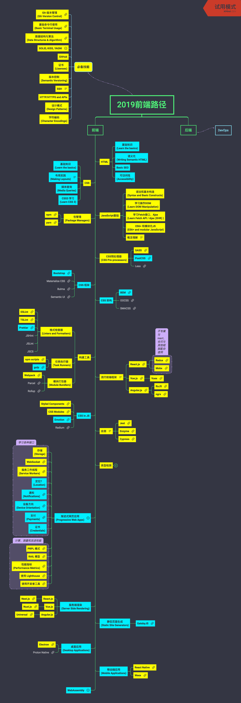

# 2019前端路径

## 前端

附图：

### HTML

- 基础知识
(Learn the basics)
- 语义化
(Writing Semantic HTML)
- Basic SEO
- 可访问性
(Accessibility)

### CSS

- 基础知识
(Learn the basics)
- 布局实践
(Making Layouts)

  浮动(Floats)
  定位(Positioning)
  展示(Display)
  盒模型(Box Model)
  网格布局(CSS Grid)
  弹性布局(Flex Box)

- 媒体查询
(Media Queries)
- CSS3 学习
(Learn CSS 3)

### JavaScript基础

- 语法和基本构造
(Syntax and Basic Constructs)
- 学习操作DOM
(Learn DOM Manipulation)
- 学习Fetch接口、Ajax
(Learn Fetch API / Ajax (XHR) )
- ES6+ 和模块化JS
(ES6+ and modular JavaScript)
- 概念理解

  主机(Hosting)
  事件冒泡(Event Bubbling)
  作用域(Scope)
  原型(prototype)
  Shadow DOM
  严格模式(strict)
  浏览器工作原理(how browsers work)
  域名系统(DNS)
  网络协议(HTTP)

### 包管理
(Package Managers)

- npm

- yarn

### CSS预处理器
(CSS Pre-processors)

- SASS

- PostCSS

- Less

### CSS 框架

- Bootstrap

- Materialize CSS

- Bulma

- Semantic UI

### CSS 架构

- BEM

- OOCSS

- SMACSS

### 构建工具

- 格式检查器
(Linters and Formatters)

	- ESLint

	- TSLint

	- Prettier

	- JSHint
	- JSLint
	- JSCS

- 任务执行器
(Task Runners)

	- npm scripts

	- gulp

- 模块打包器
(Module Bundlers)

	- Webpack

	- Parcel

	- Rollup

### 流行前端框架

开始之前，你应该对单页应用、它如何运行和它的优缺点有一个了解。

- React.js

	- Redux

	- Mobx

- Vue.js

	- Vuex

- Angular.js

	- RxJS

	- ngrx

### CSS in JS

- Styled Components

- CSS Modules

- Emotion

- Radium

### 自测

单元测试(Unit)
集成测试(Integration)
功能测试(Functional)

- Jest

- Enzyme

- Cypress

### 渐进式网页应用
(Progressive Web Apps)

Progressive Web App 具备以下特点：
渐进式 - 适用于选用任何浏览器的所有用户，因为它是以渐进式增强作为核心宗旨来开发的。
自适应 - 适合任何机型：桌面设备、移动设备、平板电脑或任何未来设备。
连接无关性 - 能够借助于服务工作线程在离线或低质量网络状况下工作。
类似应用 - 由于是在 App Shell 模型基础上开发，因此具有应用风格的交互和导航，给用户以应用般的熟悉感。
持续更新 - 在服务工作线程更新进程的作用下时刻保持最新状态。
安全 - 通过 HTTPS 提供，以防止窥探和确保内容不被篡改。
可发现 - W3C 清单和服务工作线程注册作用域能够让搜索引擎找到它们，从而将其识别为“应用”。
可再互动 - 通过推送通知之类的功能简化了再互动。
可安装 - 用户可免去使用应用商店的麻烦，直接将对其最有用的应用“保留”在主屏幕上。
可链接 - 可通过网址轻松分享，无需复杂的安装。

- 存储
(Storage)
- WebSocket

- 服务工作线程
(Service Workers)

- 定位？
(Location)
- 通知
(Notifications)

- 设备方向
(Device Orientation)

- 支付
(Payments)

- 证书
(Credentials)
- PRPL 模式

- RAIL 模型

- 性能指标
(Performance Metrics)

- 使用 Lighthouse

- 使用开发者工具

### 类型检测

- TypeScript

- Flow

  不推荐，基本处于快废弃的状态。

### 服务端渲染
(Server Side Rendering)

- React.js

	- Next.js

- Vue.js

	- Nuxt.js

- Angular.js

	- Universal

### 静态页面生成
(Static Site Generators)

- GatsbyJS

### 桌面应用
(Desktop Applications)

- Electron

- Proton Native

### 移动端应用
(Mobile Applications)

- React Native

- Weex

### WebAssembly

WebAssembly是一种新的编码方式，可以在现代的网络浏览器中运行 － 它是一种低级的类汇编语言，具有紧凑的二进制格式，可以接近原生的性能运行，并为诸如C / C ++等语言提供一个编译目标，以便它们可以在Web上运行。它也被设计为可以与JavaScript共存，允许两者一起工作。

## 必备技能

### Git-版本管理
(Git-Version Control)

### 基础命令行使用
(Basic Terminal Usage)

### 数据结构与算法
(Data Structures & Algorithm)

### SOLID, KISS, YAGNI

SOLID原则：单一功能、开闭原则、里式替换、接口隔离以及依赖反转
KISS原则：设计越简单越好
YAGNI原则：适可而止

### GitHub

### 证书
(Lisenses)

### 版本控制
(Semantic Versioning)

### SSH

加密网络传输协议，在不安全的网络中为网络服务提供安全的传输环境

### HTTP/HTTPS and APIs

### 设计模式
(Design Patterns)

### 字符编码
(Character Encodings)
